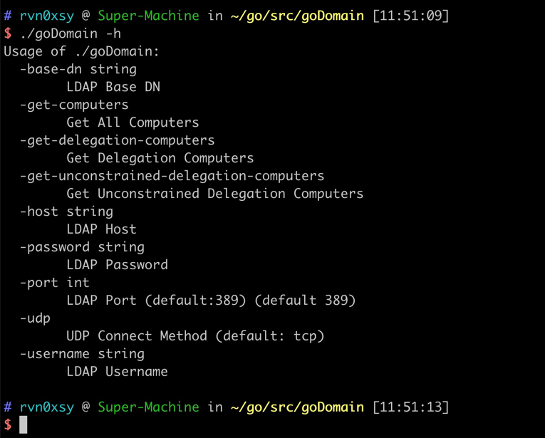
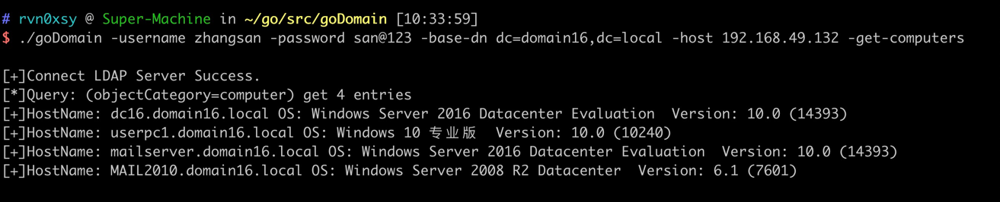
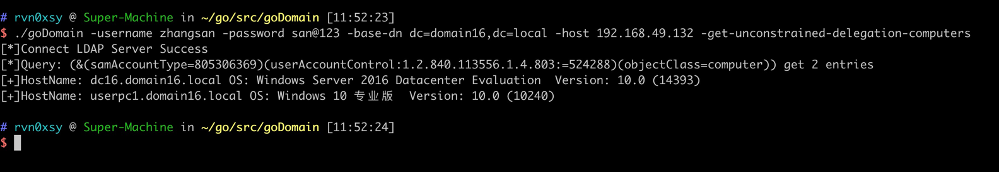
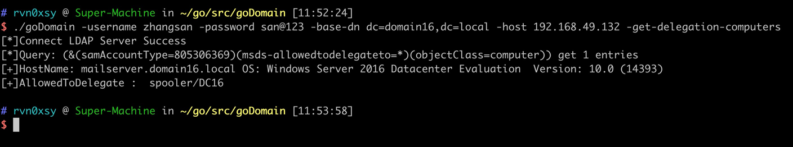

# goDomain

> Windows活动目录中的LDAP信息收集工具

文章：[Windows活动目录中的LDAP](https://payloads.online/archivers/2021-08-11/1)

## 使用示例



### 获取域内所有机器DN、操作系统、版本号

```
$ goDomain -username <Username> -password <Password> -base-dn <BaseDN> -host <LDAP-Server> -get-computers
```



### 获取域内所有非约束委派机器DN、操作系统、版本号

```
$ goDomain -username <Username> -password <Password> -base-dn <BaseDN> -host <LDAP-Server> -get-unconstrained-delegation-computers
```



### 获取域内所有约束委派机器DN、操作系统、版本号、约束信息


```
$ goDomain -username <Username> -password <Password> -base-dn <BaseDN> -host <LDAP-Server> -get-delegation-computers
```


